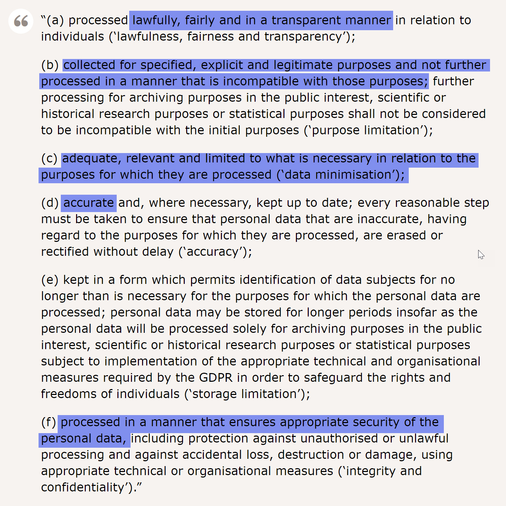

# Thinking about data capture

## What do we mean by data capture?
Data capture is simply the process of bringing data into a system. If we have a form that people have to fill in to register, and we bring that data into a database for use later, that's data capture. Data capture lies at the heart of the whole data environment; if we don't capture data, we don't have data!

## Why we need to think about data capture

Data capture is generally the moment that data quality is established. That means that if we don't focus on making sure the data we collect is of good quality, we'll have bad quality data to work with later, which is a huge headache. By good quality, we mean easy to work with, easy for programs to understand, easy to aggreagate and run calcualtions on, etc...

At the point of data capture, we need to ensure we've thought ahead to how we'll be working with that data in the future. If we're recording a phone number, we should make sure the user can't enter text. If we're recording a date of birth, we need to make sure the date is in a consistent format. Data validation and input controls on forms help ensure this; validation allows us to refuse data that isn't right for us (like when someone enters text in their phone number) and controls help ensure data is entered consistently (like requiring a users to use a date picker for their date of birth.)

## What do our regulators say about collection?
Yup, we're back to GDPR again! GDPR establishes rules for how we collect and handle data, to make sure we do so in the best interest of data subjects:

... Providing yet more considerations when establishing a system of data capture.

## What are some key principles of good data capture?
Here are some key principles that will make it easier to think about data capture:

### Keep It Simple Stupid
Create forms and inputs that are easy to understand, and leave no ambiguities about what is required. Make it as simple as possible for people to fill in; don't call that field number, call it mobile number!

### Be conventional
Conventions exist for a reason; they make it easier for people to do things quickly. It's conventional for a registration form to start with the name details, so start with the name details. Sturcture your forms in a way people expect, and you'll get better data (not mention more completed forms!)

### Be consistent
Nothing trips a user up quite like inconsistencies. If you ask for mobile number with a country code, and home number without, that's going to cause users to pause or become confused. It leads to poorly completed forms (see above) and it also leads to bad data, as it's harder to compare values across fields.

### Minimise actions
The more a user has to do, they less likely they are to do it. If you don't need to record why they chose to fill out this form on a Monday, and what the weather is like outside, then don't! If a user can quickly tab and click their way through a short and elegant form then they're more likely to complete it, and more likely to complete it accurately.

### Think about diversity
OK, so maybe it's not going to factor into data quality; but do you really need to record a user's title? If there are ways that you can be more inclusive, like skipping title or gender, or including a more full list of genders (rather than just male or female) then your users are going to be happier. If nothing else, a happy user is more likely to take the time to make sure they've filled out the form accurately.

### Assist folks in filling the form out well
In the scope of filling out webforms, little is more annoying that clicking submit, only to see big red text telling you you did something wrong. Oh, *now* you tell me that my password has to be less than 16 characters! This is easily avoided by telling the user what they need to do upfront; provide tooltips in form fields, hover text or call outs. Make it as easy as possible to give you the data you want, in the format you need.

## How can we plan our data capture?
Great, so what now? Time to plan out your data capture! To get started, here are some valuable questions you should be asking:

### Why do we need to capture this data?
The first thing you need, when looking to set up data capture, is to know why you're doing it! There's no sense just randomly collecting info; you should be doing data capture with a specific use in mind. For instance, if you're looking to set up a customer service form, you're end goal is being able to resolve customer contacts, with a bonus feature of analysis. With your intent properly laid out, you can more readily answer all of the questions that are to follow.

### What information do we need to capture?
Now that you know *why* you need data, you're ready to think about *what* data you need. Using our customer service form example again; we'll need a name, an email address, and a comment section to record the problem or question. We may want a category section to make it easier to sort and process incoming contacts. If we're receiving replacement or postage requests we may need an address or even a phone number. As with understanding why we need data, knowing what data we need to capture will provide answers to future questions. But staying on the topic of *what* data we need...

### Do we **REALLY** need that personally identifiable info?
Any data that can be used to identify a person is a risk, so if we record a name and an address we'd better have a good need for it. If we're making a form to record feedback on a website that's currently under development we may want to record an email address for following up, but do we need a physical address, or even a name? We should always ask ourselves if we really need a bit of info, are we going to need it to be able to complete the aim of this capture project? If not, don't ask it.

### What types of analysis are we expecting to do?
Ultimately, unless we're doing something short term (i.e. a form for people to update their address) we're going to want to be able to analyse the data we get on aggregate. Individual records on customer service issues help us resolve those issues, but they don't help us identify patterns in complaints, or trends in particular requests. Try to think about what kind of reports you'd want to see once the data capture is in place.

### What data types do we need and which fields can come from a constrained list?
Data comes in a whole range of types; from numbers to text, logic to dates. We should always record data in the right type; so numbers should be stored as numbers, not as text. This makes it much easier to work with, and analyse our data. It's also important that we constrain the way that data is entered into our system, even within the confines of data types. If we end up with dates in various formats, it's going to be impossible to query our data by date. So we should build in data validation, and where possible provide pre-populated list or controls like date pickers in place of free fields.

### What things can we do to make it easier to for folks to complete the form?
Dropdowns and date pickers don't just make for better quality data, they also make it easier for people to fill in our forms. Other things to consider include:
- layout
  - Is it easy to understand what to fill out next?
- Readability
  - Is it clear what data goes where, and in what format?
- Accessibility
  - Can the form be processed by a screen reader? Is it responsive to different screen layouts? Can it easily be translated?

### What audit data do we need?
Like with analysis, we may need to keep certain records for auditing purposes, such as access rights, creation and modified dates. While this won't go directly into the form design, we still need to be mindful of it, as it will become more relevant as we connect the form to our databases.
 

## Demo
Lets take a look at a quick demo now, in which we use the super handy webforms service, Airtable, to design a form for managing a bacon roll run!

## Exercises
1. Identify a form that you use regularly
2. What parts make it easier for you to fill in?
3. Which parts make it harder for you to complete?
4. What ways could this form be amended?

## Recommended resources amd readings
- :book: [Nudge](http://geni.us/nudge)
- :page_facing_up: [Design better forms](https://uxdesign.cc/design-better-forms-96fadca0f49c)
