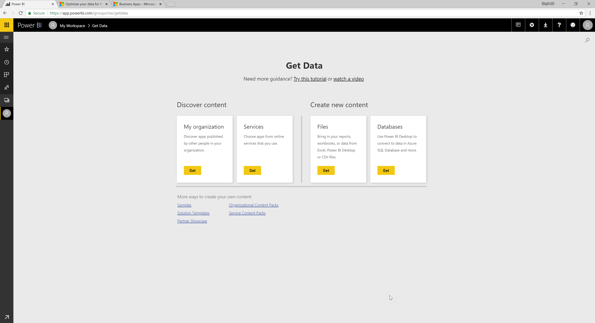
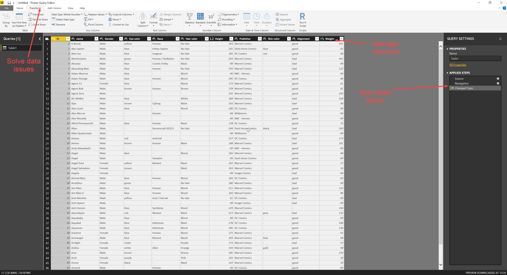
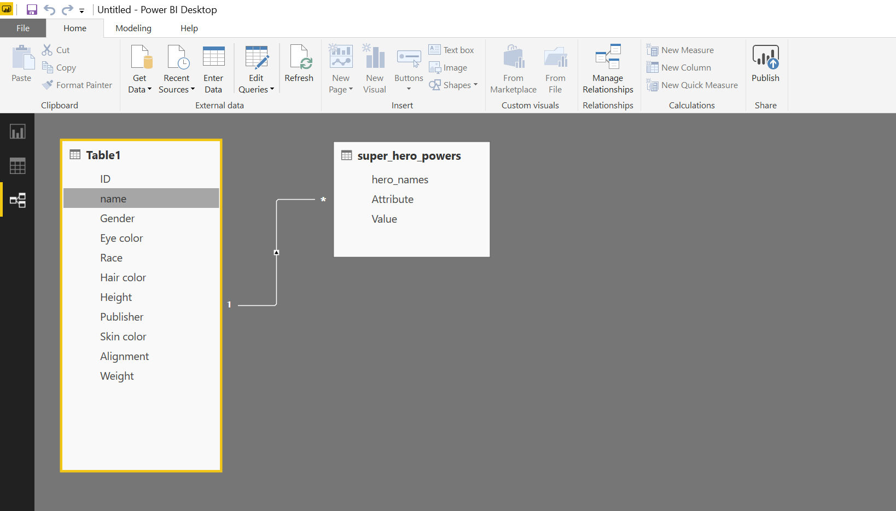

# Data sources and how to use them

## Power BI online data sources
Power BI has a number of content packs that are "ready to go" for making dashboards easily. Using pre-generated data is a good way to get our heads around the basics of Power BI, but we have less ability to tinker with data and create connected up datasets this way due to restrictions on the data sources provided.

We can also upload data and build reports online, or work locally, either with real data from within the organisation, or with dummy data from other sources. Working with real data is great for understanding how the organisation's data works, but should be avoided when not needed (GDPR, remember?) so dummy data is the best way to go. By dummy data we mean fake data, created expressly for this purpose, like Microsoft's well known AdventureWorks Database.

### Demos
- Peruse the available content packs, revisit the github report.
- Upload some data from your device

## Get Data in the app
Power BI can handle data inputs from a wide range of sources, and even allows us to join data from various different sources, making it an extremely powerful tool for reporting. Simply select a data source type from the drop-down list under Get Data, and locate a data source of that type to connect to. From there we can start adjusting the incoming data to make sure it works the way we need it to.

## Transform it in the app
Data coming from one source won't always mesh well with data from other sources; there may be differences in formatting, missing keys, different grouping logic, or we may just need a calculated field. Power BI allows us to make all of these changes within the report, so that all of our data works the way we want it to, without affecting the original data.

When we Get Data, Power BI will open a new window, providing a range of tools for working with the incoming data. On the Transform tab we can pivot and unpivot the data, change data types, group records, run scripts, set rounding rules, and much more! We can also use the Add Column tab to add measures and calculated fields, useful for KPIs and keys.

## Connecting data sets
Data rarely comes from one place: We might have a list of customers stored in a database, and form responses from customers elsewhere. We might have sales data stored in Access and sales forecasts in a spreadsheet. We already saw how easy it is to bring data from various sources into Power BI, but once we've got the data, we need often to connect it to other data to get the most out of it.

Click on the New Source button on the Home tab of the get Data window (or click Get Data again.) This will allow us to bring more connections into Power BI, to build up a Data Model (a map of multiple sources, what changes they need, and how they're connected.)

Once we've got all the connections we want, we need to close and apply our changes to return to the main window of Power BI. From here, we click the relationships view button on the left of the screen to see each of our connections, and the data they bring in. From here we can drag values from one table to another to form relationships, linking the tables together. Power BI will detect the type of relationship (i.e one key here matches one key there (1:1), one key here matches many keys there (1:*))

Now our data sources are connected to each other, so when we're building a report we can work with the data as if it all came from the same place.

### Demos
- Add flights data and make adjustments if useful
- Add carrier data and make adjustments if useful
- Join the two datasets
- Show how this impacts the report building capability

## Exercises
1. Use the online version to upload the `heroes_information.csv`
2. Use the *Quick Insights* feature to see what Power BI pulls out of the data
3. In the Power BI app, import the `heroes_information.csv` and clean up the data as part of the import
4. In the app, also load the `heroes_powers.csv`
5. Link the two datasets together
    + Hint: Use the `Keep Rows` transformation to de-duplicate data

## Recommended resources and readings
- :page_facing_up: [:computer: data sources](https://docs.microsoft.com/en-us/power-bi/desktop-data-sources)
- :page_facing_up: [Shape and combine data](https://docs.microsoft.com/en-us/power-bi/desktop-shape-and-combine-data)
