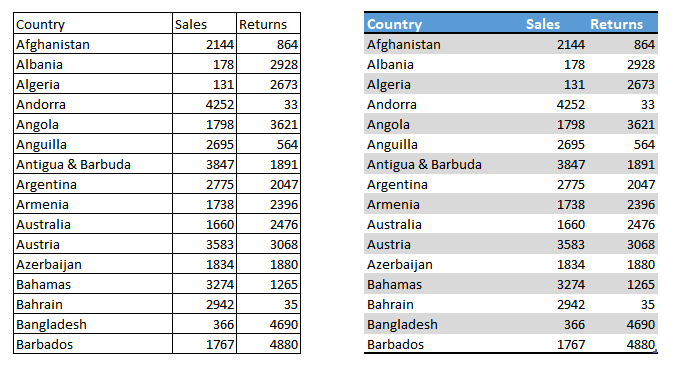

# Data visualisation
Data visualisation is the part of the process where we make out data readable, pretty, informative, and digestable. It's where we'll format tables, create charts, provide methods of changing the view of data, and generally make our reports look lovely.

## Tables
It may seem like any table is the same as any other, but there are some tricks to formatting a table that make them much easier to read. clean row lines or alternating row colours make it easier to read along a single record, distinct headers make it easier to find the right column, alignment can either be used to denote data types (numbers right align, wheras text left aligns) or to eavently space data so it is easier to read down a column:

## Charts
Charts (or graphs) are a key element of data visualisation; they allow us to quickly view the most important elements of our data, and see patterns emerging. They come in a wide variety, and each has it's place. It's important that we use the right type of chart for what we need to represent, and this illustration by Andrew Abela shows the right way to think about this:

### Best practices
Like with tables, it's important that we give some time to thinking about formatting our charts. Too much going on can make it hard to see patterns, a lack of titles makes it impossible to understand!

- Minimal colours and "things" on the chart make it easier to read
- Titles are important
- Sorting by what we're trying to communicate makes patterns easier to see
- Make colours distinct (think about black and white printing or colour blindness)

And here's an awesome step by step guide to improving charts from Darkhorse Analytics: 

### Demos
- Build a chart 
- Change it to different types
- Review the sorting options
- Ad a second chart and show how they can filter each other

## Formatting
Formatting includes not only colour and font, but also formatting currency, decimals, dates, etc...

We should ensure that our formatting is consistent; if we want to have currency symbols left aligned, we should do this everywhere. Consistent formatting makes it easier to read reports, inconsistent formatting throws people off.

### Conditional formatting
Conditional formatting is where we provide rules that dictate how something is formatted, like having negative values show up in red. It's very useful, but should be used sparingly.

### General theming
Many reporting programs have built in formatting options, or themes, which can make it quick and easy to apply consistent styles to your reports, but you can also define your own. As with data formatting, if we choose a theme, we should be consistent with it's application.

### Best practices
- Think about things like Red / Green colour blindness
- Be consistent
- Keep styles simple, stick to only a few, distinct colours
- Don't be afraid of white space

### Demos
- Theme the charts built so far
- Make a frequency table and use the conditional formatting on it

## Custom viz
- Marketplace
- [Make your own](https://www.youtube.com/watch?v=_zd-UGfD2Os&list=PL1ROw3K8pbB1JQl8NloqZISqvp60Y1JGx&index=2)

## Exercises
1. Start developing charts and tables that explore the superheroes data

## Recommended resources and readings
- :globe_with_meridians: [From data to viz](https://www.data-to-viz.com/)
- :book: [Show me the numbers](http://geni.us/showmethenumbers)
- :book: [The Truthful Art](http://geni.us/truthfulart)
