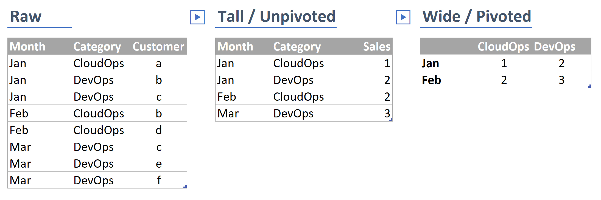

# Interpreting raw data
So we've got data, but what does it mean? It's easy enough to read most data, but it helps to have a solid understanding of how data is structured. Being able to interpret raw data (i.e. data that hasn't been nicely formatted for end users) is key to being able to use it effectively.

## Core concepts
Data serves different purposes beyond simply holding information; many records we keep won't even been seen by the end user. Here are some examples of the kind of things data may be used for:

- **Observation** Recording the details *something* (like an instance of a customer buying something)
- **Measures** Numeric values quantifying *something* (like the value of a sale)
- **Attributes** Properties of *something* (like a customer's date of birth)
- **Identifier** / **Key** A value or combination of values that uniquely identifies *something* (like a customer's email)
- **Surrogate key** A placeholder value that can be used (often a number) to represent *something* (like a customer reference number)

## Tables
Tables are what we tend to work with most often day to day. Even when we get data from systems via an API, we usually make it look like a table. Tables are simply data presented in a row/column format, where a single record takes up a single row, and all data for that record is placed in the relevant columns of that row.

A table consists of: 
- **Rows**: A record or observation about *something*
- **Columns**: Attributes or information relating to *something*

We often describe tables as having certain shapes. Common shapes include:
- **Wide** / **Pivoted**: Where the same value was measured repeatedly and occurs going across (like a record for each type of sale, with a column for each month)
- **Long** / **Unpivoted**: Where instances of repeat measures have their own rows (like a record for each sale, with a month column)
- **Normalised** / **Relational**: Only data about the thing is directly included, perhaps with links to information about other things (like a record for each sale, with links to other tables detailing attributes of the sold products)
- **Denormalised** / **Flat**: Like wide, but collapses all the relationships into a single row (like having everything you need to know on a sale in one row*)

*\*This last one may be what you end up with when you merge records together for reporting, and it sounds very useful, but it takes up more space, and makes it much less flexible.*

## Data types
Data Types tell our systems what kind of data it's being given, this is important for making sure certain functions work (like date calculations,) enables data validation (like making sure we're being given a real date,) and reducing the amount of space data takes up.

There are quite a few data types, but these are the main ones we need to be concerned with:

- **Numberic**: Is a whole number or a decimal and can be positive or negative
- **Integer**: Is a whole number
- **Character** / **String**: Is text
- **Boolean**: Is TRUE or FALSE
- **Date** / **Datetime** Is a point in time

## Data quality
We already talked about data quality, but it's worth considering again from the perspective of interpreting data.

### Missing data
If data is missing, we usually need to work out why. Is it due to the information being optional? System error? Is it new? Depending on why data is missing impacts our handling of it. If we can't be certain that data will be present, we can't get any value out of the reporting we do. Once we track down why data is missing, we'll need to go back a step and ensure that it won't be missing again, or that we've accounted for it.

### Bad data
Data isn't always very clean! There might be lots of test@test.com, default values for birthdays, crazy income outliers and more. We should check for this sort of thing before it impacts our analysis. We can build reports to help us look for bad data, and we should be consistent with identifying and removing (actually, we should flag it as excluded, not delete it, just in case) any bad data as we continue to utilise this data.

## What to do when you first get some new data
Once we've got some data, we should take the time to look through it, and make sure we understand what we have:

1. Check the number of rows and columns, does it seem right?
2. Work out what the key is
3. Identify the shape of the data
4. Check the data types are what you'd expect
5. Identify any missing values and whether you need to do something about them
6. See if there are any unusual values in the data

## Exercises
1. What things should be improved in our data?
2. Implement some of the improvements you've identified

## Recommended readings and resources
- :page_facing_up: [Pivoting and unpivoting data](http://radacad.com/pivot-and-unpivot-with-power-bi)
- :page_facing_up: [Getting simple data profiles](https://blog.crossjoin.co.uk/2016/01/12/descriptive-statistics-in-power-bim-with-table-profile/)
