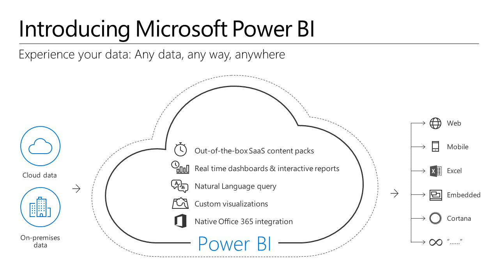
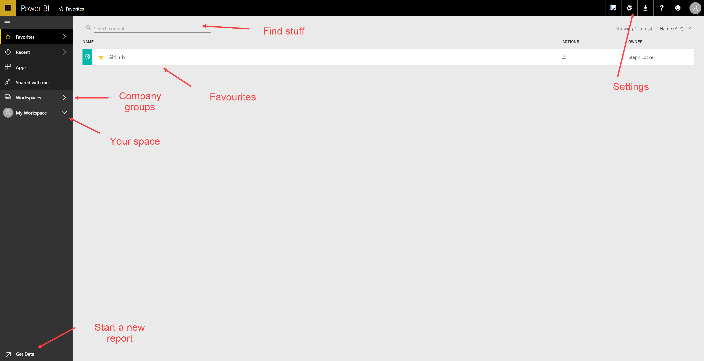
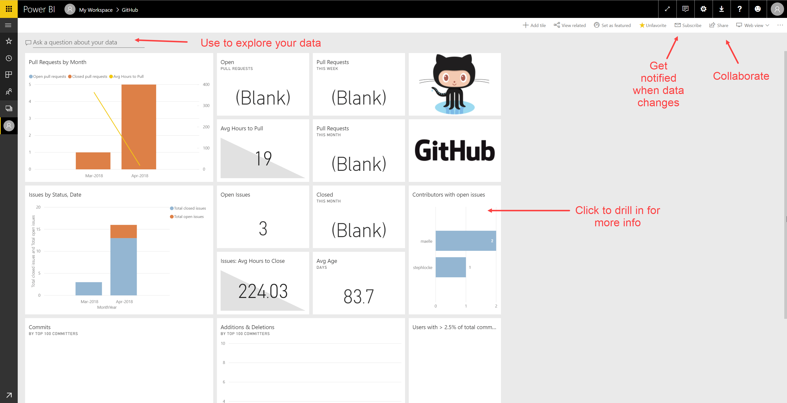
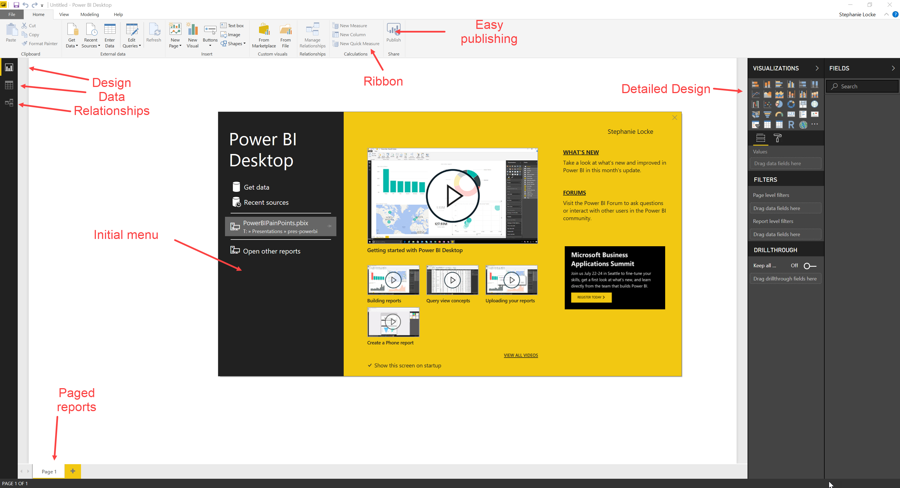

# Power BI

## What is Power BI?

Power Bi is Microsoft's new solution to dashboarding, reporting, and multi-user accessibility. It allows you to bring data in from multiple sources, mash it up, edit it, join it, and then report it on it. After that you can share it online with your organisation, so others can build easy, drag-and-drop reports and dashboards with it.

## Why Power BI?
Power BI can handle all kinds of data, from all kinds of places, and has incredibly powerful and intuitive tools for reporting. By using Power BI, we can work with all the different kinds of data we want to -- and produce the kind of reports we want to -- quickly and easily, and all in one place.

By using this single service for everything we'll be covering, we can get on with learning what really matters, rather than getting bogged down in how to use the systems.

## Getting started with Power BI

## Navigating Power BI online

### Demos
Using Power BI online
- Logging into Power BI online
- Connecting to a service
- Exploring the dashboard
- Asking questions
- Viewing the underlying reports

## Navigating Power BI desktop

### Demos
Using Power BI desktop
- Load some data
- Produce a basic visualisation

## Exercises
1. Install Power BI app from the Windows store
1. Register for Power BI
1. On the online platform connect to a Service you use in your day job
1. Explore the results

## Recommended resources and readings
- :globe_with_meridians: [Power BI homepage :house:](http://powerbi.microsoft.com)
- :globe_with_meridians: [Power BI docs :books:](http://support.powerbi.com/)
- :globe_with_meridians: [Power BI community :dancers:](http://community.powerbi.com/)
- :globe_with_meridians: [Power BI blog :page_facing_up:](http://blogs.msdn.com/b/powerbi/)
- :globe_with_meridians: [Power BI guided learning :mortar_board:](https://docs.microsoft.com/en-us/power-bi/guided-learning/index)
- :mortar_board: [Power BI certification](https://www.microsoft.com/en-us/learning/exam-70-778.aspx)
- :bird: [@guyinacube](https://twitter.com/guyinacube)
- :bird: [@br0adtree](https://twitter.com/Br0adtree)
- :bird: [@dataveld](https://twitter.com/dataveld)
- :bird: [@pkamasani](https://twitter.com/pkamasani)
- :bird: [@cwebb_bi](https://twitter.com/cwebb_bi)
