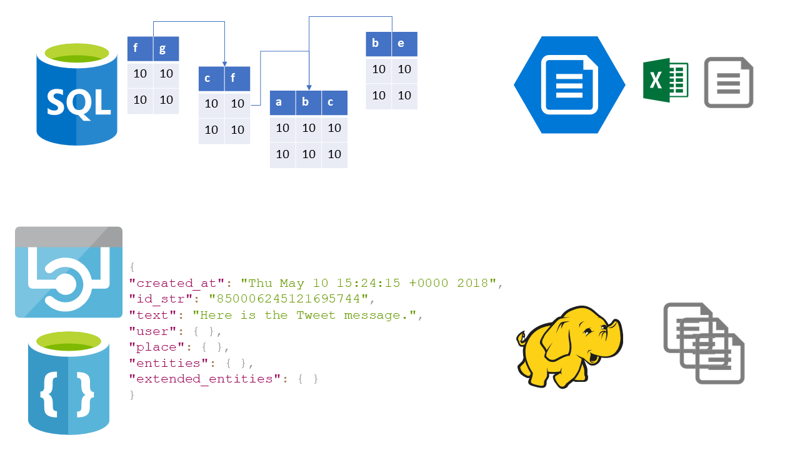

# Understanding what data is
Before we get stuck in , we should start by answering an important question:

## What is data?
Data is information on a thing. This thing can be anything from an atom, to a lion, to a country, to you.

Here's an example of all the different kinds of data we may store on a thing, and how it works:

This cartoon representation of Steph is an image, which is stored on a computer as code. Although all we see is an image, the data on the image includes meta-data (data about the data, i.e. when it was made.) We can also see how additional data can be created by using AI to interpret the data (i.e by adding information like "this is a person" and "they are happy") and even how we may add data personally to the main data, by making assumptions (i.e. "these are legs.")

Data is a hot topic at the moment, as a result of GDPR. Companies around the world now need to be open and mindful of how they handle data they hold on any given person. The following video explains the importance of being aware of how you expose your data:

[Your data matters](https://youtu.be/_RVPj-GSOdY)

<iframe width="560" height="315" src="https://www.youtube-nocookie.com/embed/_RVPj-GSOdY?rel=0&amp;showinfo=0" frameborder="0" allow="autoplay; encrypted-media" allowfullscreen></iframe>

## Why does it matter?
As a company, data is invaluable. With it we can ensure the company is compliant, profitable, and effective. If we don't store, manage, and access our data properly the business is exposed to risk, and will struggle to function properly. For example: if a car sales company doesn't properly record data on sales, or doesn't have an easy means of viewing data on sales, they won't be able to know what kinds of cars are the most popular, what colours to buy in, or what offers are proving to be the most effective.

## Thinking about data safely
We already mentioned risk and GDPR. It's extremely important that your company's data is stored securely, managed properly, and accessed only when, and as much, as needed. Failure to apply rigorous controls to how you acquire and handle data can 
lead to data breaches, and hefty fines.

Data should be stored and managed by experienced staff, and only accessed by people who need to do so in order to do their jobs. For instance: if we have records of who in the company has taken sick leave this year, only staff in the HR department should be able to view all records, and a manager should only be able to view the records of people they manage. The folk who deliver the sandwiches shouldn't have any access to this data!

Data shouldn't be stored in a manner that exposes it to risk; it shouldn't be kept on a portable flash drive, or printed off and left on a desk, and if we don't need it any more (i.e. a streaming subscription service doesn't need our bank details if we cancel the service) the data should be deleted!

## How is data stored?
Data is stored in a vast array of ways, from databases to spreadhseets, CSVs to "cloud" storage. Different forms of storage also entail different ways of recording, handling, and querying data. If data is stored in a SQL database, it will be stored using a relational model, handled and modified using specific code, and queried using that code too. Even if we bring the information the data holds into a report, and present it using something else, like Excel, the data itself is still coming from the SQL database; we just changed the way it looks.

However it's stored, these collections of data are often referred to as "data stores". Further, if we then connect to a particular set of data for reporting, that connection points at a "data source."

Below you can see a number of ways of storing data, clockwise from the top left: SQL Server databases, storing relationally linked (i.e. linked by a common value, like an ID or the date) tables of data; Single file data in tables, like Excel or CSV; distributed (clustered or even "big data") data, where data is held loosely across a number of files and even in different formats; and document stores, where data is held in key/value pairs within a text document.

## Exercises
1. In pairs, list some of the organisation's data stores
2. What's risky about these data stores?
3. What might they be useful for?

## Resources and recommended readings
- :book: [Weapons of Math Destruction](http://geni.us/mathdestruction)
- :book: [Innumeracy](http://geni.us/innumeracy)
- :book: [Naked Statistics](http://geni.us/nakedstatistics)
- :book: [Information is beautiful](http://geni.us/infoisbeautiful)
- :page_facing_up: [Satya Nadella on Digital Transformation](https://blogs.msdn.microsoft.com/jmeier/2017/10/30/satya-nadella-on-digital-transformation-2018/)
