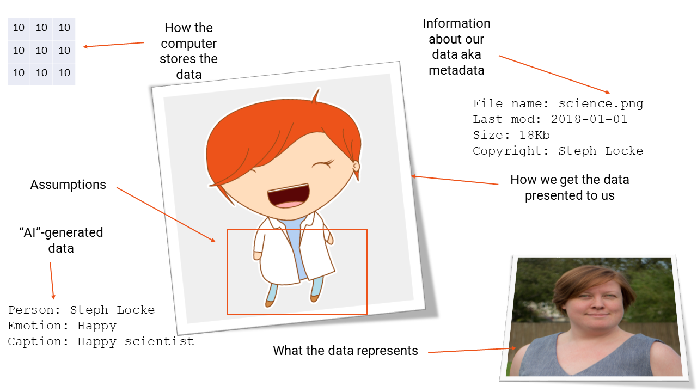
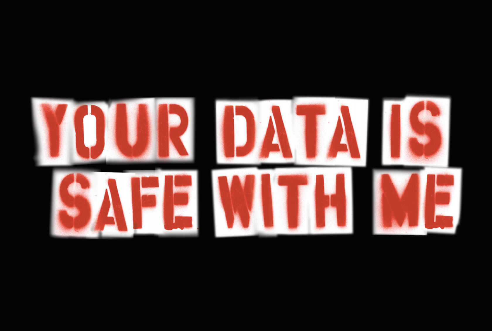

# Understanding what data is

- Benefits
- Challenges
- Databases
- Non-relational

## What is data?

[Your data matters](https://youtu.be/_RVPj-GSOdY)

## Why does it matter?

## Thinking about data safely

## How is data stored?

## Exercises
1. In pairs, list some of the organisations data stores
2. What's risky about them?
3. What might they be useful for?

## Resources and recommended readings
- :book: [Weapons of Math Destruction](http://geni.us/mathdestruction)
- :book: [Innumeracy](http://geni.us/innumeracy)
- :book: [Naked Statistics](http://geni.us/nakedstatistics)
- :book: [Information is beautiful](http://geni.us/infoisbeautiful)
- :page_facing_up: [Satya Nadella on Digital Transformation](https://blogs.msdn.microsoft.com/jmeier/2017/10/30/satya-nadella-on-digital-transformation-2018/)
